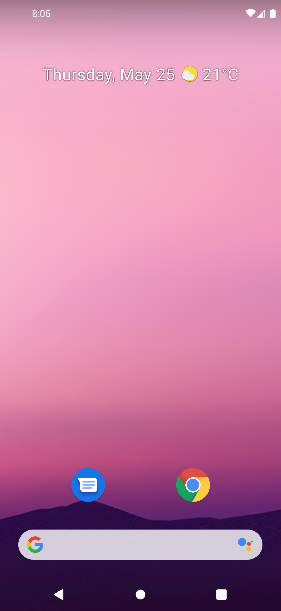
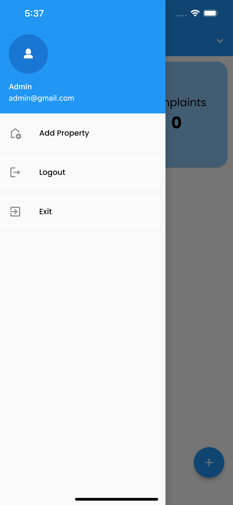
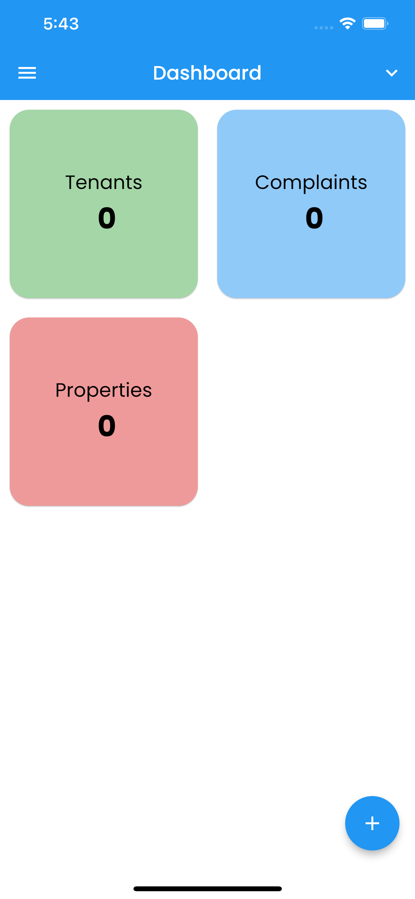

# Nyumbayo App

An app that will help property owners or landlord to manage their tenants.

## Landlord's UI Screenshots
<div style="display:flex;flex-direction:row;justify-content:space-evenly;align-items:center;">



</div>

## Project Setup
```
    git clone https://github.com/bse23-4/nyumbayo_app.git
```
## Navigate to the project
```
cd nyumbayo_app
```
### Run the application
```
flutter run -v
```

## Project Setup
- Controllers
- Models
- Widgets
- Views
- Observers
- Tools
- Exports
- Themes
  
## Tech Stack
- Flutter (Dart)
- Firebase
